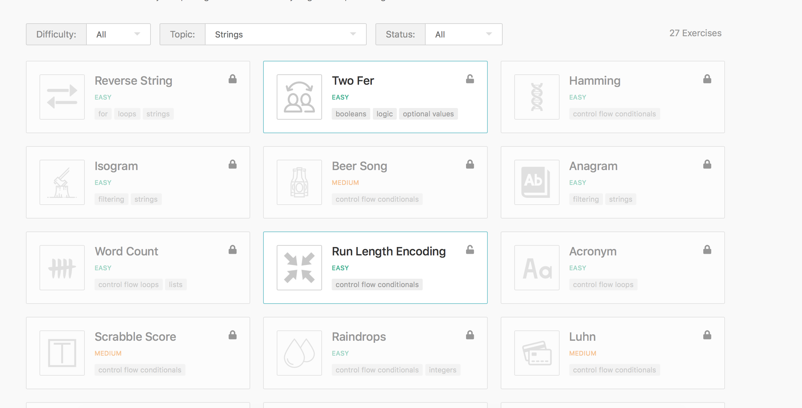

# 5. Summary

## Look ma I know JavaScript! 

After previous four modules you should get familiarity with basic of programming and language itself. 

During one of the first sessions with your mentor he will help you setup exercism.io so that you can start donig exercises on your local machine. If you haven't done the setup until please, reach to your mentor before your next session and ask them for help.

If you feel adventerous you can try to [set it up yourself](https://exercism.io/tracks/javascript/installation).

### Daily Practise

One of the most important aspects of becoming confident with your skills in any discipline is practise. Like a pianist who practises every day until they stop thinking about how their fingers move, we encourage you to make daily practise of coding part of your life. 

It doesn't need to be long - just **20 minutes per day** is enough to establish solid routine.

We recommend using extra exercises in exercism.io for your practise which you can find at the bottom of [track page](https://exercism.io/my/tracks/javascript).

For example, if you are feeling you need more practise with string manipulation you just select this topic and start doing exercises one by one.

### Putting it all together

Now we are going to take your basic knowledge and build a simple application with you. At this stage you don't yet know how to get information from users. So we will just be working with fixed data for now - ask your mentor to help you setup a dataset and to show users information you can use simple console.log. 

**Estimated time: 2 mentor sessions.** 

